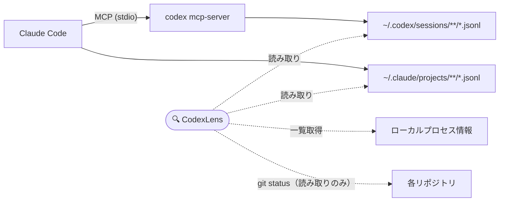

<p align="center">
  
</p>

<h1 align="center">CodexLens</h1>

<p align="center">
  <b>AIコーディングエージェントが「いま何をしているか」を一目で。</b><br>
  OpenAI Codexの動きをローカルで観測する、読み取り専用のmacOSメニューバーアプリです。Claude CodeがMCP経由でCodexを動かしているときに特に便利です。
</p>

<p align="center">
  <a href="https://github.com/Yukhy/codexlens/actions/workflows/ci.yml"></a>
  <a href="https://github.com/Yukhy/codexlens/releases/latest"></a>
  <a href="https://github.com/Yukhy/codexlens/releases"></a>
  <a href="LICENSE"></a>
  
  
</p>

<p align="center">
  <a href="README.md">English</a> | <b>日本語</b> | <a href="README.zh-CN.md">中文</a>
</p>

---

Claude CodeからMCP経由でCodexに長いタスクを任せると、ターミナルはしばらく沈黙します。

Codexは考えているのか、ファイルを編集しているのか、それとも固まっているのか。気になって画面を切り替えたり、`ps aux | grep codex` を今日何度も打ったり——そんな経験はないでしょうか。

**CodexLensなら、メニューバーから一目で分かります。**

- 🟢 Codexはまだ動いているか
- 📁 どのリポジトリ・ブランチで作業しているか
- 🏷️ 呼び出し元はClaude CodeのMCPか、`codex exec` か、Codexアプリか
- 🚦 状態は実行中・待機中・停滞・失敗・完了のどれか

CodexLensはMCPサーバーを作らず、ラップせず、プロキシもしません。**Macにすでに存在するセッションファイルとプロセス情報を読むだけ**です。

## スクリーンショット

| アクティビティ一覧 | 設定画面 |
| --- | --- |
|  |  |

## 機能

- 🖥️ **メニューバーに常駐** — レンズアイコンをクリックするだけで、ローカルのCodex実行を一覧表示。Dockも占有しません
- 🚦 **状態をリアルタイム表示** — 実行中／待機中／停滞／失敗／完了。イベントが更新されなくなったジョブの停滞検知つき
- 🏷️ **呼び出し元ラベル** — Claude CodeのMCP呼び出し、`codex exec`、Codex MCP、Codexアプリ、単独セッションを一目で区別
- 📁 **リポジトリ情報** — 作業ディレクトリ、Gitブランチ、変更ファイル数、現在のイベント、最終更新時刻をジョブごとに表示
- 🔍 **フィルターと検索** — 実行中／要確認／完了／すべてのタブに加え、パス・ジョブ名・呼び出し元での絞り込み
- 🧭 **ワンクリックで移動** — リポジトリを開く、Codexのrolloutファイルを表示、Claude Codeのログを開く
- 🌏 **多言語UI** — 英語・日本語・中国語
- 🔒 **ローカル完結・読み取り専用** — テレメトリなし、プロキシなし、設定変更なし
- ⬆️ **手動アップデート確認** — 設定画面で現在のバージョンを確認し、自分がクリックしたときだけGitHub Releasesに新版を問い合わせ
- ⌨️ **CLIスナップショット** — `npm run scan` で同じ内容をターミナルにも出力

## インストール

### アプリ版をダウンロード（推奨）

1. [**GitHub Releases**](https://github.com/Yukhy/codexlens/releases/latest) から最新のDMGをダウンロードします。Apple Siliconは `arm64`、Intel Macは `x64` を選んでください。
2. DMGを開き、**CodexLens** を **アプリケーション** フォルダへドラッグします。
3. 起動して、メニューバーのレンズアイコンをクリックすれば完了です。

> [!IMPORTANT]
> 現在の配布物は**未署名**のため（Apple Developer証明書を未取得）、初回起動時にmacOSが警告を表示します。
> **システム設定 → プライバシーとセキュリティ** を開いて下までスクロールし、**「このまま開く」** をクリックしてください。ターミナルからは次のコマンドでも解除できます。
>
> ```bash
> xattr -cr /Applications/CodexLens.app
> ```
>
> すべてのDMGはこのリポジトリから[GitHub Actions](.github/workflows/release.yml)でビルドされており、中身は誰でも監査できます。署名・公証済みビルドは[ロードマップ](#ロードマップ)に含まれています。

### ソースコードから起動

Node.js 20以上とnpmが必要です。

```bash
git clone https://github.com/Yukhy/codexlens.git
cd codexlens
npm install
npm run open:mac
```

ターミナルでスナップショットだけ見たい場合:

```bash
npm run scan
```

## 仕組み



CodexもClaude Codeも、詳細なセッションログをすでにディスクへ書き出しています。CodexLensはそのファイルを読み、関連するローカルプロセスを一覧し、スレッドID・作業ディレクトリ・タイミングを手がかりにジョブ単位のカードへまとめます。それだけです——非公開APIも通信の傍受も使っていません。

## プライバシー

CodexLensは**ローカル完結・読み取り専用**です。これは後付けの配慮ではなく、このツールの存在意義そのものです。

| 読み取るもの | 決して行わないこと |
| --- | --- |
| `~/.codex/session_index.jsonl` | `~/.codex/auth.json` などの認証情報の読み取り |
| `~/.codex/sessions/**/*.jsonl` | テレメトリやセッションデータの外部送信 |
| `~/.claude/projects/**/*.jsonl` | プロンプト全文やツール引数のデフォルト表示 |
| ローカルの `claude` / `codex mcp-server` / `codex app-server` のプロセス情報 | Claude Codeと `codex mcp-server` 間のstdioパイプの盗み見 |
| 検出した作業ディレクトリのgit status（読み取りのみ） | Claude Code・Codex・MCP設定・リポジトリ・セッションファイルの変更 |

CodexLensが行う通信は、ユーザーが自分で操作したときだけです。設定画面の**「アップデートを確認」**をクリックすると `api.github.com` へ最新リリースのバージョンを1回だけHTTPSで問い合わせ、ダウンロードはブラウザで開きます。バックグラウンドでの自動チェックはありません。

> [!NOTE]
> ジョブの識別に役立つため、CodexLensは `~/.codex/session_index.jsonl` にあるCodexのスレッドタイトルを表示することがあります。スレッドタイトルやローカルパスに機密性の高いプロジェクト名が含まれる場合は、スクリーンショットの共有にご注意ください。

## よくある質問

**OpenAIやAnthropicの公式ツールですか？**
いいえ。CodexLensは独立した非公式ツールです。非公開APIは使わず、CodexとClaude Codeがもともとディスクに書き出しているセッションファイルを読んでいるだけです。

**コードやプロンプトがどこかに送信されませんか？**
されません。テレメトリはありません。通信が発生するのは、設定画面で自分からアップデート確認を実行したときだけです。

**macOSに「開発元を確認できない」と言われます**
現在のビルドが未署名のためです。[インストール手順](#アプリ版をダウンロード推奨)にある2クリックの回避方法をご覧ください。署名対応はロードマップに載っています。

**Claude Codeを使っていなくても役に立ちますか？**
はい。`codex exec`、Codexアプリ、単独のCLIセッションもそのまま観測できます。Claude CodeとCodexの紐付けは、MCPユーザー向けの追加機能という位置づけです。

**パネルに何も表示されません。壊れていますか？**
デフォルトのフィルターは**実行中**のジョブのみ表示します。**すべて**に切り替えると直近の履歴も見えます。それでも空の場合は、`~/.codex` や `~/.claude` にセッションファイルがまだ存在していません。先にCodexまたはClaude Codeを一度動かしてみてください。

**「呼び出し元」ラベルはどのくらい正確ですか？**
スレッドID・作業ディレクトリ・タイミングによる推定です。一般的なケースでは正しく判定されますが、[制限事項](#制限事項)もご覧ください。

## 制限事項

- Claude Codeのツール呼び出しとCodexのrolloutファイルの紐付けはヒューリスティックであり、まれに誤ることがあります。
- MCP実行中にCodexがrolloutファイルを更新しない場合、プロセスやリポジトリの状態は表示できますが、詳細な進捗は追えません。
- サブエージェント数は、Codexがrolloutファイルに識別可能なイベントを記録している場合のみ表示されます。
- Apple Developer IDのシークレットを設定するまで、リリースは未署名です（詳細は[配布ドキュメント](docs/distribution.md)）。

## ロードマップ

- [ ] 署名・公証済みビルド（Apple Developer ID）
- [ ] Homebrew cask対応
- [ ] 署名済みビルドでのアプリ内アップデート
- [ ] ジョブの停滞・失敗時の通知（オプトイン）

アイデアがあれば[Issueを立ててください](https://github.com/Yukhy/codexlens/issues/new/choose)。小さく的を絞った提案ほど早く実現できます。

## コントリビュート

IssueもPRも歓迎です。手順とプロジェクト構成は [CONTRIBUTING.md](CONTRIBUTING.md) をご覧ください。Issue・PRには、生のセッションログ、プロンプト本文、トークン、非公開リポジトリのパスを含めないようお願いします。

## ☕ 応援する

CodexLensは無料のオープンソースで、本業の合間に、ほぼコーヒーだけを燃料に開発されています。

「Codex、まだ生きてる…？」と静まり返ったターミナルを覗き込む時間がこのアプリで減ったなら、次の深夜リリースの燃料を1杯おごっていただけるとうれしいです。

<a href="https://buymeacoffee.com/yukhy0119e"></a>

GitHub派の方はページ上部の**Sponsor**ボタンからどうぞ。リポジトリへの⭐も大きな励みになります——CodexとClaude Codeを併用している誰かが、このツールを見つけるきっかけになります。

## Star History

<a href="https://www.star-history.com/#Yukhy/codexlens&Date">
  
</a>

## 免責事項

CodexLensは独立した非公式ツールであり、OpenAIおよびAnthropicとは提携・承認・後援などの関係は一切ありません。"Codex"および"Claude"は各社の商標です。

## ライセンス

[MIT](LICENSE) © Yukhy
