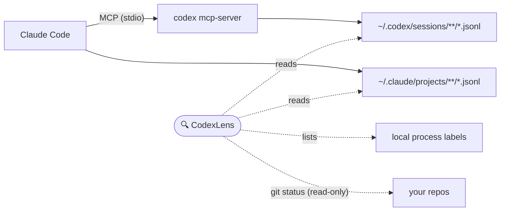

<p align="center">
  
</p>

<h1 align="center">CodexLens</h1>

<p align="center">
  <b>See what your AI coding agents are actually doing.</b><br>
  A local, read-only macOS menu bar monitor for OpenAI Codex — especially when Claude Code drives it over MCP.
</p>

<p align="center">
  <a href="https://github.com/Yukhy/codexlens/actions/workflows/ci.yml"></a>
  <a href="https://github.com/Yukhy/codexlens/releases/latest"></a>
  <a href="https://github.com/Yukhy/codexlens/releases"></a>
  <a href="LICENSE"></a>
  
  
</p>

<p align="center">
  <b>English</b> | <a href="README.ja.md">日本語</a> | <a href="README.zh-CN.md">中文</a>
</p>

---

You hand a long task to Codex from Claude Code over MCP… and the terminal goes quiet.

Is Codex thinking? Editing files? Stalled? Dead? You alt-tab, squint at logs, maybe `ps aux | grep codex` for the tenth time today.

**CodexLens answers that in one glance from your menu bar:**

- 🟢 Is Codex still running?
- 📁 Which repo and branch is it working in?
- 🏷️ Was it invoked by Claude Code MCP, `codex exec`, or the Codex app?
- 🚦 Is it active, idle, stalled, failed, or completed?

It creates, wraps, proxies, and replaces **nothing**. CodexLens only reads session files and process info that already exist on your Mac.

## Screenshots

| Activity overview | Settings |
| --- | --- |
|  |  |

## Features

- 🖥️ **Lives in your menu bar** — one click on the lens icon shows every local Codex run; no dock icon, no window clutter
- 🚦 **Live status** — active / idle / stalled / failed / completed, including stall detection for runs that stop writing events
- 🏷️ **Source labels** — tell Claude Code MCP calls apart from `codex exec`, Codex MCP, the Codex app, and standalone sessions at a glance
- 📁 **Repo context** — working directory, git branch, changed file count, current event, and last activity time per run
- 🔍 **Filter & search** — Active / Attention / Completed / All tabs, plus free-text filtering by path, job, or source
- 🧭 **Deep links** — open the repo, reveal the Codex rollout file, or jump to the Claude Code log for any run
- 🌏 **Multilingual UI** — English, 日本語, 中文
- 🔒 **Local-only & read-only** — no telemetry, no proxying, no config changes
- ⬆️ **Manual update check** — see your version in Settings and check GitHub Releases only when *you* click
- 🚀 **Launch at login** — optional; flip the toggle in Settings
- ⌨️ **CLI snapshot** — `npm run scan` prints the same overview in your terminal

## Install

### Download the app (recommended)

1. Download the latest DMG from [**GitHub Releases**](https://github.com/Yukhy/codexlens/releases/latest) — `arm64` for Apple Silicon, `x64` for Intel Macs.
2. Open the DMG and drag **CodexLens** into **Applications**.
3. Launch it and click the lens icon in your menu bar.

> [!IMPORTANT]
> CodexLens ships **without Apple notarization** — this project intentionally doesn't join the Apple Developer Program. macOS will therefore block the first launch with a warning such as *"Apple could not verify…"* or *"CodexLens is damaged"*. The app is fine; this is Gatekeeper's standard reaction to downloads it can't verify. Pick either fix:
>
> ```bash
> xattr -cr /Applications/CodexLens.app
> ```
>
> …or open **System Settings → Privacy & Security**, scroll down, and click **"Open Anyway"**.
>
> This is a one-time step. Every DMG is built from this repository by [GitHub Actions](.github/workflows/release.yml), so you can audit exactly what goes into it.

### Run from source

Requires Node.js 20+ and npm:

```bash
git clone https://github.com/Yukhy/codexlens.git
cd codexlens
npm install
npm run open:mac
```

For a one-shot snapshot in the terminal:

```bash
npm run scan
```

## How it works



Codex and Claude Code already write detailed session logs to your disk. CodexLens tails those files, lists the relevant local processes, and correlates them into per-run cards using thread IDs, working directories, and timing. That's the whole trick — no private APIs, no traffic interception.

## Privacy

CodexLens is **local-only and read-only**. That's the point of the tool, not an afterthought.

| It reads | It never |
| --- | --- |
| `~/.codex/session_index.jsonl` | reads `~/.codex/auth.json` or any credentials |
| `~/.codex/sessions/**/*.jsonl` | sends telemetry or session data anywhere |
| `~/.claude/projects/**/*.jsonl` | shows full prompt text or tool arguments by default |
| local `claude` / `codex mcp-server` / `codex app-server` process labels | inspects the private stdio pipe between Claude Code and `codex mcp-server` |
| read-only git status of detected working directories | modifies Claude Code, Codex, MCP config, your repos, or session files |

The only network requests CodexLens makes are the ones you trigger yourself: clicking **Check for updates** sends a single HTTPS request to `api.github.com` to read the latest release version, and download links open in your browser. There are no background checks.

> [!NOTE]
> CodexLens may display Codex thread titles from `~/.codex/session_index.jsonl` because they help identify runs. If your thread titles or local paths contain sensitive project names, be careful when sharing screenshots.

## FAQ

**Is this an official OpenAI or Anthropic tool?**
No. CodexLens is independent and unofficial. It uses no private APIs — it reads the same session files Codex and Claude Code already write to your disk.

**Does it send my code or prompts anywhere?**
No. There is no telemetry. The only network access is the update check you trigger manually in Settings.

**Why does macOS say the app can't be verified?**
Builds are unsigned because the project doesn't use an Apple Developer certificate. See the [install notes](#download-the-app-recommended) for the two-click workaround — you only need it once.

**Do I need Claude Code for it to be useful?**
No. CodexLens also watches plain `codex exec`, Codex app, and standalone CLI sessions. The Claude Code ↔ Codex correlation is a bonus for MCP users.

**The panel is empty — is it broken?**
The default filter shows **Active** runs only; switch to **All** to see recent history. If there's still nothing, no session files exist yet under `~/.codex` / `~/.claude` — start a Codex or Claude Code session first.

**How accurate is the "invoked by" label?**
It's heuristic: thread IDs, working directories, and timing. It's right in the common cases, but see [limitations](#limitations).

## Limitations

- Correlation between Claude Code tool calls and Codex rollout files is heuristic-based and can occasionally mismatch.
- If Codex doesn't update its rollout files while running under MCP, CodexLens can still show process/repo state but not detailed progress.
- Subagent counts appear only when Codex records distinguishable events in rollout files.
- Releases are unsigned, so macOS shows a one-time Gatekeeper prompt on first launch ([distribution details](docs/distribution.md)).

## Roadmap

- [ ] Homebrew cask
- [ ] Opt-in notifications when a run stalls or fails

Have an idea? [Open an issue](https://github.com/Yukhy/codexlens/issues/new/choose) — small, sharp feature requests are the easiest to ship.

## Contributing

Issues and PRs are welcome — see [CONTRIBUTING.md](CONTRIBUTING.md) for the quick guide and project layout. Please never include raw session logs, prompt text, tokens, or private repository paths in issues or PRs.

## ☕ Support

CodexLens is free and open source, built in the gaps between real work and fueled almost entirely by coffee.

If it has saved you from alt-tabbing into a silent terminal for the hundredth time, wondering *"is Codex still alive?"* — you can fund the next late-night release:

<a href="https://buymeacoffee.com/yukhy0119e"></a>

Prefer GitHub? The **Sponsor** button up top works too. And a ⭐ on this repo genuinely helps other Codex × Claude Code users find it.

## Star History

<a href="https://www.star-history.com/#Yukhy/codexlens&Date">
  
</a>

## Disclaimer

CodexLens is an independent, unofficial tool. It is not affiliated with, endorsed by, or sponsored by OpenAI or Anthropic. "Codex" and "Claude" are trademarks of their respective owners.

## License

[MIT](LICENSE) © Yukhy
