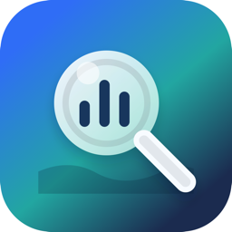
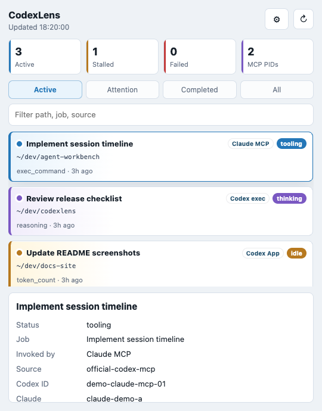
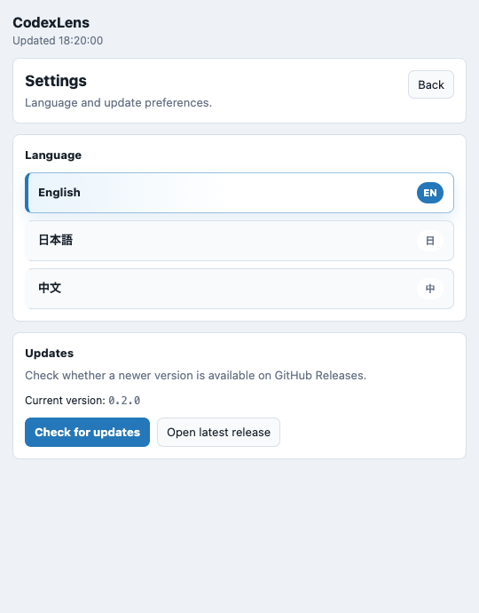
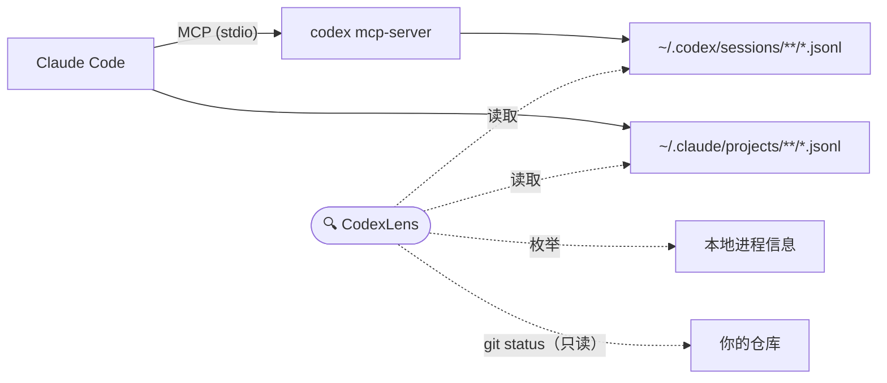

<p align="center">
  
</p>

<h1 align="center">CodexLens</h1>

<p align="center">
  <b>一眼看清你的 AI 编程智能体正在做什么。</b><br>
  本地运行、只读的 macOS 菜单栏监视器，用于观察 OpenAI Codex 的活动——尤其适合 Claude Code 通过 MCP 驱动 Codex 的场景。
</p>

<p align="center">
  <a href="https://github.com/Yukhy/codexlens/actions/workflows/ci.yml"></a>
  <a href="https://github.com/Yukhy/codexlens/releases/latest"></a>
  <a href="https://github.com/Yukhy/codexlens/releases"></a>
  <a href="LICENSE"></a>
  
  
</p>

<p align="center">
  <a href="README.md">English</a> | <a href="README.ja.md">日本語</a> | <b>中文</b>
</p>

---

当你在 Claude Code 里通过 MCP 把一个长任务交给 Codex 之后，终端往往会陷入长时间的沉默。

Codex 是在思考？在改文件？还是已经卡住了？于是你来回切换窗口、翻日志，甚至一天里第十次敲下 `ps aux | grep codex`。

**有了 CodexLens，在菜单栏里看一眼就够了：**

- 🟢 Codex 还在运行吗？
- 📁 它正在哪个仓库、哪个分支上工作？
- 🏷️ 这次调用来自 Claude Code 的 MCP、`codex exec`，还是 Codex 应用？
- 🚦 当前状态是运行中、空闲、停滞、失败，还是已完成？

CodexLens 不创建、不封装、不代理、也不替换任何 MCP server。**它只读取你 Mac 上本来就存在的会话文件和进程信息。**

## 截图

| 活动概览 | 设置界面 |
| --- | --- |
|  |  |

## 功能

- 🖥️ **常驻菜单栏** — 点一下镜头图标即可查看所有本地 Codex 任务，不占 Dock、不开多余窗口
- 🚦 **实时状态** — 运行中／空闲／停滞／失败／已完成，并能检测出不再写入事件的"假活着"任务
- 🏷️ **来源标签** — 一眼区分 Claude Code 的 MCP 调用、`codex exec`、Codex MCP、Codex 应用和独立会话
- 📁 **仓库上下文** — 每个任务的工作目录、Git 分支、变更文件数、当前事件和最后活动时间
- 🔍 **筛选与搜索** — 运行中／需关注／已完成／全部四个标签页，外加按路径、任务名、来源的全文筛选
- 🧭 **快捷跳转** — 一键打开仓库、定位 Codex rollout 文件、或跳转到对应的 Claude Code 日志
- 🌏 **多语言界面** — 英文、日文、中文
- 🔒 **仅本地、只读** — 无遥测、无代理、不修改任何配置
- ⬆️ **手动检查更新** — 在设置中查看当前版本，只有你主动点击时才会向 GitHub Releases 查询新版本
- ⌨️ **命令行快照** — `npm run scan` 在终端输出同样的概览

## 安装

### 下载应用（推荐）

1. 从 [**GitHub Releases**](https://github.com/Yukhy/codexlens/releases/latest) 下载最新的 DMG：Apple Silicon 选 `arm64`，Intel Mac 选 `x64`。
2. 打开 DMG，把 **CodexLens** 拖入 **Applications** 文件夹。
3. 启动后点击菜单栏中的镜头图标即可。

> [!IMPORTANT]
> 目前的构建**未签名**（尚未获取 Apple Developer 证书），首次启动时 macOS 会弹出警告。
> 请打开 **系统设置 → 隐私与安全性**，滚动到底部，点击 **"仍要打开"**；也可以在终端执行：
>
> ```bash
> xattr -cr /Applications/CodexLens.app
> ```
>
> 每一个 DMG 都由 [GitHub Actions](.github/workflows/release.yml) 从本仓库构建，内容完全可审计。签名与公证构建已列入[路线图](#路线图)。

### 从源码运行

需要 Node.js 20+ 和 npm：

```bash
git clone https://github.com/Yukhy/codexlens.git
cd codexlens
npm install
npm run open:mac
```

只想在终端看一次快照：

```bash
npm run scan
```

## 工作原理



Codex 和 Claude Code 本来就会把详细的会话日志写入磁盘。CodexLens 读取这些文件、枚举相关的本地进程，再依据线程 ID、工作目录和时间线，把它们汇总成一张张任务卡片。仅此而已——不使用任何私有 API，也不拦截任何流量。

## 隐私

CodexLens **仅在本地运行、只读**。这不是事后补充的承诺，而是这个工具存在的前提。

| 它会读取 | 它绝不会 |
| --- | --- |
| `~/.codex/session_index.jsonl` | 读取 `~/.codex/auth.json` 等任何凭据 |
| `~/.codex/sessions/**/*.jsonl` | 向外发送遥测或会话数据 |
| `~/.claude/projects/**/*.jsonl` | 默认展示完整 prompt 或工具参数 |
| 本地 `claude` / `codex mcp-server` / `codex app-server` 的进程信息 | 窥探 Claude Code 与 `codex mcp-server` 之间的私有 stdio 管道 |
| 检测到的工作目录的 git status（只读） | 修改 Claude Code、Codex、MCP 配置、你的仓库或会话文件 |

CodexLens 发起的所有网络请求都由你亲手触发：点击设置中的**"检查更新"**时，它会向 `api.github.com` 发送一次 HTTPS 请求读取最新版本号；下载链接则在浏览器中打开。没有任何后台检查。

> [!NOTE]
> 为了便于识别任务，CodexLens 可能会显示 `~/.codex/session_index.jsonl` 中的 Codex 线程标题。如果线程标题或本地路径包含敏感的项目名称，分享截图时请注意。

## 常见问题

**这是 OpenAI 或 Anthropic 的官方工具吗？**
不是。CodexLens 是独立的非官方工具，不使用任何私有 API——它读取的是 Codex 和 Claude Code 本来就写在磁盘上的会话文件。

**它会把我的代码或 prompt 发送到别处吗？**
不会。没有任何遥测。唯一的网络请求是你在设置中手动触发的更新检查。

**为什么 macOS 提示"无法验证开发者"？**
因为当前构建未签名——参见[安装说明](#下载应用推荐)中两步即可解决的方法。签名计划见路线图。

**不用 Claude Code 也有用吗？**
有用。CodexLens 同样可以观察 `codex exec`、Codex 应用和独立的 CLI 会话。Claude Code 与 Codex 的关联只是给 MCP 用户的加分项。

**面板是空的，是坏了吗？**
默认筛选只显示**运行中**的任务，切换到**全部**可以看到近期历史。如果仍然为空，说明 `~/.codex` / `~/.claude` 下还没有会话文件——先运行一次 Codex 或 Claude Code 即可。

**"调用来源"标签有多准确？**
它基于线程 ID、工作目录和时间线的启发式推断，常见场景下是准确的，边界情况见[已知限制](#已知限制)。

## 已知限制

- Claude Code 工具调用与 Codex rollout 文件之间的关联是启发式的，偶尔可能匹配错误。
- 如果 Codex 在 MCP 运行期间不更新 rollout 文件，CodexLens 仍能显示进程／仓库状态，但无法展示详细进度。
- 只有当 Codex 在 rollout 文件中记录了可区分的事件时，才能看到 subagent 数量。
- 在配置 Apple Developer ID 密钥之前，发布的构建均未签名（详见[分发文档](docs/distribution.md)）。

## 路线图

- [ ] 签名与公证构建（Apple Developer ID）
- [ ] Homebrew cask
- [ ] 签名构建的应用内自动更新
- [ ] 任务停滞／失败时的可选通知

有想法？欢迎[提 Issue](https://github.com/Yukhy/codexlens/issues/new/choose)——目标明确的小建议最容易落地。

## 参与贡献

欢迎 Issue 和 PR，快速上手指南与项目结构见 [CONTRIBUTING.md](CONTRIBUTING.md)。请不要在 Issue 或 PR 中包含原始会话日志、prompt 内容、token 或私有仓库路径。

## ☕ 支持项目

CodexLens 是免费的开源项目，诞生于工作之余的深夜，基本靠咖啡驱动。

如果它让你少了几次盯着毫无动静的终端、心里嘀咕*"Codex 还活着吗？"*的时刻，欢迎请我喝杯咖啡，为下一个深夜版本充值燃料：

<a href="https://buymeacoffee.com/yukhy0119e"></a>

习惯用 GitHub 的话，页面顶部的 **Sponsor** 按钮同样有效。给仓库点个 ⭐ 也是实实在在的帮助——它能让更多同时使用 Codex 和 Claude Code 的人发现这个工具。

## Star History

<a href="https://www.star-history.com/#Yukhy/codexlens&Date">
  
</a>

## 免责声明

CodexLens 是独立的非官方工具，与 OpenAI 或 Anthropic 没有任何隶属、认可或赞助关系。"Codex" 与 "Claude" 为其各自所有者的商标。

## 许可证

[MIT](LICENSE) © Yukhy
